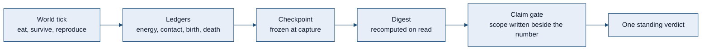
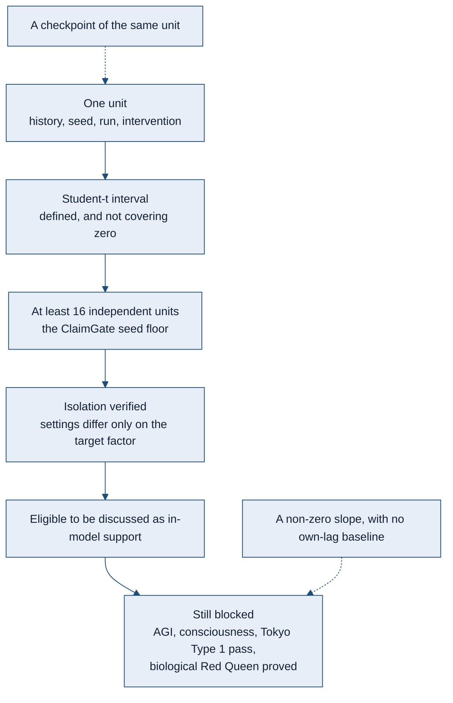
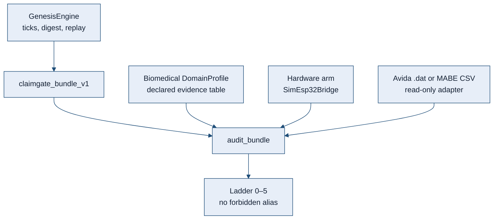

# CodonTrace Genesis

<p align="center">
  <a href="https://pypi.org/project/codontrace/"></a>
  <a href="https://www.python.org/"></a>
  <a href="https://github.com/Parvaz-Jamei/codontrace-genesis/actions/workflows/ci.yml"></a>
  <a href="https://doi.org/10.5281/zenodo.20337435"></a>
  <a href="https://github.com/Parvaz-Jamei/codontrace-genesis/blob/main/LICENSE"></a>
</p>

<p align="center">
  <strong>A world small enough to replay, and a claim strict enough to refuse itself.</strong><br>
  Research software. Not a proof of intelligence, and not a biological result.
</p>

CodonTrace Genesis is a laboratory you can run twice and get the same world back.

You set down a small place. Simple agents eat, survive, and reproduce. The energy of each birth comes out of the parent. The questions are evolutionary: does an antagonist push a lineage somewhere new, does a costly behavior hold its ground, does a line recover after its path is cut. The library exists so those questions can be asked without the answer being talked into shape afterwards. A birth names its parent. A checkpoint is the moment it was taken, not whatever the run became later. A number is stored beside the only scope it is allowed to have.

The aim is not to announce a Red Queen, an open-ended mind, or a medical device. The aim is a digital-evolution engine whose ledgers, forks, and verdicts stay weaker than the temptation to overclaim them. Four words are allowed at the end of a test, and only one of them is support, and only inside the model that was actually run: `SUPPORTED_IN_MODEL`, `FALSIFIED_IN_MODEL`, `INCONCLUSIVE`, `BLOCKED_MEASUREMENT`. On the standing ledger, the Red Queen is not proved.

Domain modules sit beside that life-loop. They do not replace it. The installable package is `codontrace`. Product naming for contributors lives in [`CONTRIBUTING.md`](CONTRIBUTING.md) and [`STYLE.md`](STYLE.md).

---

## How to read a result

A number in this repository is not a conclusion. A standing verdict is one of four words, and only one of them may be attached to a test:

`SUPPORTED_IN_MODEL` · `FALSIFIED_IN_MODEL` · `INCONCLUSIVE` · `BLOCKED_MEASUREMENT`

The single source for the 29 September 2026 program is [`docs/experiments/2026-09-29/VERDICT_LEDGER_V1.json`](docs/experiments/2026-09-29/VERDICT_LEDGER_V1.json). On that ledger `hypothesis_supported` is false and `red_queen_proved` is false. The confirmatory campaign is not open. A green workflow is not a scientific result: the lint and typecheck job is `continue-on-error`, so a green run is not a mypy pass.

| Record | Standing verdict | What the scope actually is |
|---|---|---|
| RQ-1 time shift | `INCONCLUSIVE` | The locked pack still covers imported seeds 5701–5705. Seed 5706’s old log is partial. Seeds 5706–5708 were rerun on the current engine under `confirmatory/closure_2026-10-03/`; that rerun does not complete the locked commit `6187ff4`, which is not in this repository. Those closure files are aggregate summaries with `INCOMPLETE_PROVENANCE`. They are not a raw trajectory pack. |
| RQ-3 adaptation route | `INCONCLUSIVE` | Seeds 21001 and 21011 remain energy-confounded pilots. Seeds 21061–21063 now have current-engine summaries under `closure_2026-10-03/`. On those three seeds the coevolving common-window share ends at 0 and does not beat the frozen arm. The files are `INCOMPLETE_PROVENANCE`: they do not replace the older quotation, and they do not support the hypothesis. |
| D-2 recovery window | `BLOCKED_MEASUREMENT` | The locked 1.25× endpoint for three consecutive boundaries was not reached by the positive control. Zeros on the arms do not falsify an intervention. An earlier `FALSIFIED_IN_MODEL` is retained history, not the standing verdict. |
| Sex-cost bracket | `INCONCLUSIVE` | The measured bracket c* in (1.1, 1.2] belongs only to `infection_cost=0.4`, 400 generations, host cap 400, parasite cap 16, turnovers {1, 6, 12}, seeds 8000–8099. It is not the classical two-fold cost of sex, and it is not a result for other regimes. |
| Causal tape | `INCONCLUSIVE` | A 63–65% share is an estimator label on a synthetic fitness map. It is not an organism-level result. The tested difference is a noise-free mutation-draw intervention: an instrument check, not a do-calculus demonstration on a living population. |

Van Valen’s Red Queen (1973) is the biological hypothesis these records are *about*. None of them establishes it, in the model or outside it. Open-ended intelligence and a Tokyo Type 1 *pass* (Channon 2024) stay blocked. Measurement of a trajectory is not a pass.

---

## Figure style

Figures in this file use one palette. A later diagram should reuse these parameters rather than invent a second visual language.

| Token | Value | Role |
|---|---|---|
| `ink` | `#142033` | Text on a node |
| `rule` | `#1f4e79` | Borders and arrows |
| `wash` | `#e7eef8` | Primary node fill |
| `paper` | `#f3efe6` | Secondary node fill |
| `caution` | `#8a4b2f` | A blocked or non-claim node |
| `face` | `ui-sans-serif, system-ui, sans-serif` | Figure type |
| `size` | `15px` | Figure type size |



The path above is an engineering path. Reaching the last box does not promote the run.



Hurlbert (1984) is the reason a checkpoint is not a second replicate. Granger (1969) is the reason a slope is not a predictive gain: the comparison is a restricted regression on the target’s own lag against an unrestricted regression that also includes the source. This library reports the fractional drop in residual sum of squares. It does not report an F test, and an empty control list leaves the result a `confounded_candidate`.

---

## What the current model refuses to mix up

These are contracts of the software. They are not findings about organisms.

| Contract | What is computed | What it is not |
|---|---|---|
| Energy | A child’s energy is debited from the parent. Maintenance, death, and seat-cap removal are recorded as losses. Without a source, total energy does not rise. | An implicit gift of ATP at birth. |
| Within-class lag | Association after removing the class mean, and after removing a shared trend. The time count is the number of paired times, not classes times times. | The historical pooled Pearson. That score is kept under its own name. A constant mirror can still give correlation −1 and `pass_prelim`. That pass is not temporal evidence. |
| Association | Support requires a real contrast: both sides present, a finite test, and no invented zero for a missing group. | A label of support on an empty cell. |
| Interval | A Student-t critical value from the tail probability. One observation, or a sample with no residual variance, has a point and no interval. A bootstrap percentile may exclude zero for a claim only at the auditor floor of 16 runs, the same floor as ClaimGate level 4. | The old cliff that used 1.96 once the degrees of freedom passed 30, or a one-run interval treated as evidence. |
| Experimental unit | `(history_id, seed)` identifies the independent history block for one estimand. Run aliases and later checkpoints do not add replicates. Different interventions require separate reports or an explicitly designed dependent analysis. | Renaming runs or interventions to turn one history into sixteen independent replicates. |
| Prediction | Fractional SSE reduction against the target’s own lag. `tested_lags` lists only lags that were fit. | The absolute slope of the source, or a causal claim. |
| Time-shift archive | The feature map is a proxy over a private copy. Reads recompute the digest. Replacing a tick requires `revise(reason=...)` and keeps the superseded snapshot. | A frozen dataclass whose dict can still be edited, or a silent overwrite of history. |
| Checkpoint | State is frozen at capture. Restore checks seed, spec digest, and payload version. `exact` is true only when the frozen continuation matches. | A live reference to the parent, or a digest that ignores a field the resume can still change. |

The historical estimators stay in the tree so an old number can be reproduced and then not reused as the corrected estimand. A locked WAVE classifier that still reads `pass_prelim` does not set `red_queen_proved`.

---

## What it is

- A Python research library for controlled digital-evolution and artificial-life experiments.
- A replay and audit layer: specs, runtime digests, manifests.
- Mechanism instrumentation: ablations, treatment and control, delayed outcomes.
- A claim-gated workflow. A software capability and a runtime observation are allowed. A strong scientific conclusion is not auto-promoted.
- One biomedical port and one hardware arm on that same auditor. Further modules attach without a second engine.

## What it is not

CodonTrace Genesis is **not** currently presented as:

- proof of artificial general intelligence, consciousness, or collective intelligence
- proof of open-ended intelligence, or a Tokyo Type 1 *pass* (Channon 2024)
- a biological evolution simulator or a wet-lab chemistry engine
- a replacement for Avida (Ofria and Wilke 2004), MABE, DEAP, QDax, or pyribs
- a physical-robot platform (`SimEsp32Bridge` is an engineering stub)
- a medical device, SaMD, IVD, FDA or CE clearance, or an ASME V&V 40 certification
- an Avida or MABE campaign runner (those ClaimGate adapters stay skeletons until audited published tables exist)

Claims have to pass evidence gates. See [`CLAIMS.md`](CLAIMS.md) and [`docs/WHY_NOT_INTELLIGENCE_YET.md`](docs/WHY_NOT_INTELLIGENCE_YET.md).

---

## Status

| Field | Current status |
|---|---|
| Package | `codontrace` |
| Public PyPI wheel | `0.3.0b19`, tag [`v0.3.0b19`](https://github.com/Parvaz-Jamei/codontrace-genesis/releases/tag/v0.3.0b19). Cuts `0.3.0b4` through `0.3.0b18` are not recut. |
| GitHub `main` | `0.3.0b19`, the `[project].version` in `pyproject.toml`. |
| Python | 3.11–3.14 |
| DOI | [`10.5281/zenodo.20337435`](https://doi.org/10.5281/zenodo.20337435), the software archive, not a campaign archive |
| License | AGPL-3.0-or-later |
| HE01 | SCHEMA v7 locked. Ceiling at most `intervention_supported` when the full rule holds. |
| HE02 | Research null after analysis v1b. Ceiling stays `runtime_observation`. |
| HE03 | Code and preregistration are present. `results_v1` is absent on purpose. |
| Claim ceiling | Research software and evidence infrastructure. |

### Phases A–L

Phases A–G are the earlier `0.3.0b3` substrate. Phases H–L, HE01 SCHEMA v7, and the discovery ClaimGate pipeline shipped in public `0.3.0b4`.

| Phase | What landed | Ceiling |
|---|---|---|
| **A** | Darwinian life-loop (`life_loop_world`: eat, survive, asexual reproduction) | `runtime_observation` |
| **B** | Sexual recombination, opt-in; defaults stay asexual | `runtime_observation` |
| **C** | Fluctuating environment: chemostat, regimes, patches | `runtime_observation` |
| **D** | Multi-generation evidence; Tokyo Type 1 *measurement* only | `oee_measurement_only` |
| **E** | Capsule, memory, role, and deme substrate, opt-in | `runtime_observation` |
| **F** | Multi-seed deme payoff; division-of-labor *metrics* | `runtime_observation` |
| **G** | Named-materials overlay, opt-in | `runtime_observation` |
| **H** | Literature retrieval; communication-ablation and group-versus-individual harnesses | `runtime_observation` |
| **I** | Held-out partners; evolved division of labor; multilevel outcome; export-of-fitness scaffold | `runtime_observation`; smoke never earns a flag |
| **J** | Independent digest replay; Price-equation scaffold | `collective_intelligence_candidate` only with the full honest flags, including replay |
| **K** | Coordination-instruction analog; CPU-delay harness; conflict-suppression hooks | `runtime_observation`; smoke never earns |
| **L** | Analogs of Avida messaging and deme groups | `runtime_observation`; an analog, not an Avida port |

Still blocked: bare `collective_intelligence`, `intelligence`, AGI, `tokyo_type1_passed`, and Avida replacement. Smoke never sets ClaimGate flags. Digests are never invented.

---

## Installation

Python 3.11–3.14. CI smokes Ubuntu, Windows, and macOS on that range. The published wheel is `codontrace==0.3.0b19`. An editable install of `main` prints `0.3.0b19`.

```bash
pip install codontrace==0.3.0b19
```

```bash
pip install "codontrace[research]==0.3.0b19"
pip install "codontrace[causal]==0.3.0b19"
pip install "codontrace[qd]==0.3.0b19"
```

From source, which may be ahead of PyPI:

```bash
git clone https://github.com/Parvaz-Jamei/codontrace-genesis.git
cd codontrace-genesis
python -m pip install -e ".[dev,research,causal,qd]"
python -c "import codontrace; print(codontrace.__version__)"
```

Do not treat the version tuple as a phase fence, and do not tag or publish from a red or queued CI.

---

## Quick start

The beginner API returns the agent, the world, the trace, and an optional explanation.

```python
from codontrace import WhiteBoxAgent, World2D

world = World2D.from_ascii("""
....
.A*.
....
""")

agent = WhiteBoxAgent.from_world(world, genome="101111000", initial_atp=5.0)
result = agent.run_trial(world, steps=3, explain=True)

print(result.agent.position)
print(result.explanation.summary if result.explanation else "no explanation")
```

A research run uses an explicit spec. Empty research defaults are not a life-loop: `ResourceConfig.density=0` and a same-cell reproduction rule do not make a Darwinian substrate. Use the preset.

```python
from codontrace.genesis import GenesisEngine, GenesisRuntimeProfile

spec = GenesisRuntimeProfile.life_loop_world(seed=7, tick_count=12, population=6)
result = GenesisEngine.from_spec(spec).run_ticks()
print(result.digest()[:24])
```

Opt-in presets (sexual recombination, fluctuating environments, multi-generation measurement, materials, and the H–L harnesses) stay off unless requested, so earlier digest pins remain stable. Print-only smokes live under [`examples/`](examples/).

---

## Console

The console is a local preview module. It does not run the evolution engine, it does not execute an uploaded `.py` file, and it does not set `red_queen_proved`. A gate row is the catalog plus the latest preview in the browser, not a pytest pass. On startup, and again every 24 hours, it asks GitHub whether a newer release exists. That query does not push. A clean checkout of this repository can fast-forward; a wheel install is left as it is.

The same command works on Linux, Windows, and macOS after a normal install. No extra package and no Node process are required to open the page.

```bash
python -m codontrace.console
```

The default address is `http://127.0.0.1:8765/`. `--host` and `--port` change the bind. `--open` asks the desktop to open the page. Workers stay in 1–4. A temperature is reported only when the machine exposes a sensor file. Windows does not have a load average, so that field stays unmeasured there.

The page source lives in [`console/`](console/). Rebuild it with Node only when the interface itself changes; the result is stored under `src/codontrace/console/static` and shipped inside the wheel. The server is `codontrace.console` and does not import `engine.py`.

---

## Claim policy

| Level | Meaning |
|---|---|
| Software capability | The mechanism, API, or record exists and is tested. |
| Runtime observation | It was observed in a valid run. |
| Candidate evidence | A treatment and a control exist. |
| Mechanism support | Ablation, intervention, or a counterfactual comparison supports a mechanism *in the model*. |
| Replicated effect | The effect is stable across enough independent units. |
| Publication-grade claim | Archived artifacts, a pre-registered analysis, controls, and limitations are all present. |

`ScientificClaimGate` can allow `collective_intelligence_candidate` only when the full honest flag set is present, including replay. It does not allow bare `collective_intelligence`, `intelligence`, AGI, `tokyo_type1_passed`, or Avida replacement. Policy: [`CLAIMS.md`](CLAIMS.md). Ladder: [`docs/protocol/CLAIM_LADDER_PROTOCOL_v0.1.md`](docs/protocol/CLAIM_LADDER_PROTOCOL_v0.1.md).

---

## Architecture

The product is the engine. It does not know medicine or hardware. A new module is a `DomainProfile` or an adapter. It is not a copy of the engine.



| Port | What it ingests | Does it run the engine? |
|---|---|---|
| Native campaign | A live spec, or HE01 / HE02 / HE03 JSON | Yes, when a spec runs. A JSON adapter only reads the artifact. |
| Avida `.dat`, MABE2 CSV | Foreign run tables | No |
| Biomedical `DomainProfile` | Question of interest, context of use, risk, and a PIRT worksheet | No |
| Hardware | `SimEsp32Bridge` today | Optional |

`ALIFE` is the default profile. `BIOMEDICAL` and `HARDWARE` are the two extra profiles that ship now. The biomedical port stores ASME V&V 40, FDA 2023, IEC 62304, and IMDRF wording as **labels**. It ranks a phenomena table and caps a coupled model at its weakest submodel. A study file closes a phenomenon only when that arm was executed. A typed rank does not. Declared model risk has its own bar. The bar does not move the claim ladder. Strings such as `asme_vv40_passed`, `fda_cleared`, and `samd_certified` raise `ConfigurationError`. This is not SaMD.

```python
from codontrace.claimgate import audit_bundle
from codontrace.claimgate.adapters.codontrace import bundle_from_hard_experiment_01

report = audit_bundle(bundle_from_hard_experiment_01())
print(report.achieved_level, report.public_name, report.missing_for_next)
```

```python
from codontrace.claimgate import audit_bundle
from codontrace.claimgate.adapters.biomedical import bundle_from_device_model_cou

bundle = bundle_from_device_model_cou(
    question_of_interest="Would this score table support the claim?",
    context_of_use="Declared table only; no implant.",
    model_influence=2,
    decision_consequence=3,
    treatment_scores=(0.12, 0.11, 0.13),
    control_scores=(0.20, 0.19, 0.21),
    device_software_kind="simd_declared",
    iec_62304_class="B",
    imdrf_n12_category="II",
    fda_2023_evidence=(1, 3, 8),
    physics_based=True,
)
print(audit_bundle(bundle).achieved_level, bundle.extra["domain"], bundle.extra["model_risk"])
```

The second call stays on the biomedical port. It does not start the engine. Map: [`docs/ARCHITECTURE_PORTS.md`](docs/ARCHITECTURE_PORTS.md). Biomedical scope: [`docs/BIOMEDICAL_ENGINEERING.md`](docs/BIOMEDICAL_ENGINEERING.md). Replay contract: [`docs/ENGINE_REPLAY_CONTRACT.md`](docs/ENGINE_REPLAY_CONTRACT.md).

---

## Documentation

| Document | Use it for |
|---|---|
| [`CLAIMS.md`](CLAIMS.md) | Allowed, candidate, and blocked claims |
| [`docs/WHY_NOT_INTELLIGENCE_YET.md`](docs/WHY_NOT_INTELLIGENCE_YET.md) | Why the literature gap is not a near miss |
| [`docs/PHASE_INDEX.md`](docs/PHASE_INDEX.md) | Pointers for phases H–L |
| [`docs/CLAIMGATE_STANDALONE.md`](docs/CLAIMGATE_STANDALONE.md) | Simulator-agnostic auditor, public levels 0–5 |
| [`docs/SCIENTIFIC_AUTHORITIES_2026.md`](docs/SCIENTIFIC_AUTHORITIES_2026.md) | Feature against authority: landed, partial, deferred |
| [`REPRODUCIBILITY.md`](REPRODUCIBILITY.md) | Install, validation tiers, artifact preservation |
| [`BENCHMARKS.md`](BENCHMARKS.md) | Benchmark protocols and the claim boundary |
| [`RELEASE_EVIDENCE.md`](RELEASE_EVIDENCE.md) | Which public wheel an evidence pack covers |

The benchmark smoke is a functionality check. It is not evidence of collective intelligence.

```bash
python -m pytest tests/examples/test_collective_joss_evidence_benchmark_smoke.py -q
```

---

## Testing

```bash
python -m compileall -q src tests examples tools
python -m pytest tests/genesis_gates -q
python -m pytest tests/science_gates -q
python -m pytest tests -q
```

The full suite is what CI runs. Tiers: [`REPRODUCIBILITY.md`](REPRODUCIBILITY.md).

---

## Citation

Cite the versioned software release. The DOI is the software archive, not a campaign archive.

```bibtex
@software{codontrace_genesis_2026,
  title = {CodonTrace Genesis},
  author = {Jamei, Parvaz},
  version = {0.3.0b19},
  doi = {10.5281/zenodo.20337435},
  url = {https://github.com/Parvaz-Jamei/codontrace-genesis},
  note = {0.3.0b19 is the git identity. Cuts 0.3.0b4 through 0.3.0b18 are not recut. The DOI is the software archive, not a campaign archive.}
}
```

[`CITATION.cff`](CITATION.cff) is included for citation tools. Use of the software does not imply co-authorship.

### Works named above

These are the sources the contracts are answerable to. Naming them is not a claim that this repository has reproduced them.

- Granger, C. W. J. 1969. Investigating causal relations by econometric models and cross-spectral methods. *Econometrica* 37:424–438.
- Hurlbert, S. H. 1984. Pseudoreplication and the design of ecological field experiments. *Ecological Monographs* 54:187–211.
- Ofria, C., and C. O. Wilke. 2004. Avida: a software platform for research in computational evolutionary biology. *Artificial Life* 10:191–229.
- Student. 1908. The probable error of a mean. *Biometrika* 6:1–25.
- Van Valen, L. 1973. A new evolutionary law. *Evolutionary Theory* 1:1–30.

---

## License

CodonTrace Genesis is licensed under the **GNU Affero General Public License v3.0 or later** (`AGPL-3.0-or-later`), so that modified, redistributed, and network-deployed versions stay inspectable.

Commercial or proprietary use that cannot comply with that license may contact the author for a separate license.

See [`LICENSE`](LICENSE) and [`NOTICE`](NOTICE).

---

## Author

**Parvaz Jamei**

GitHub: [@Parvaz-Jamei](https://github.com/Parvaz-Jamei)

---

**CodonTrace Genesis** — replayable evidence for digital evolution. A run is not a verdict.
