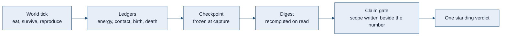
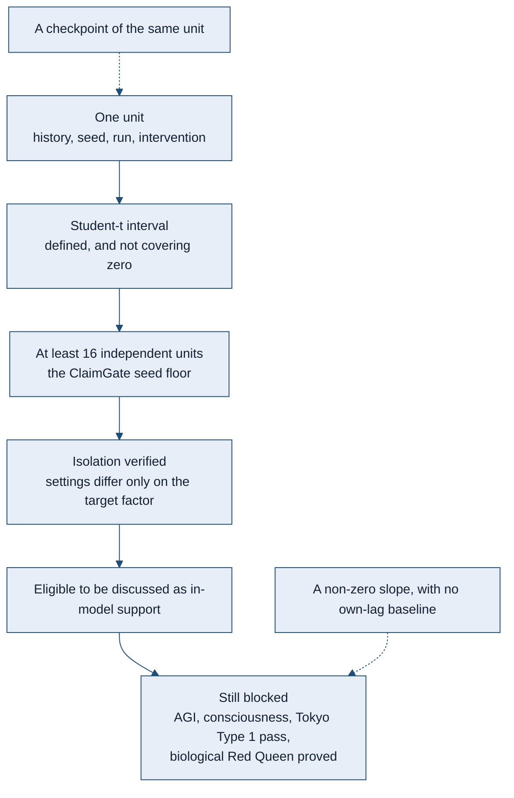
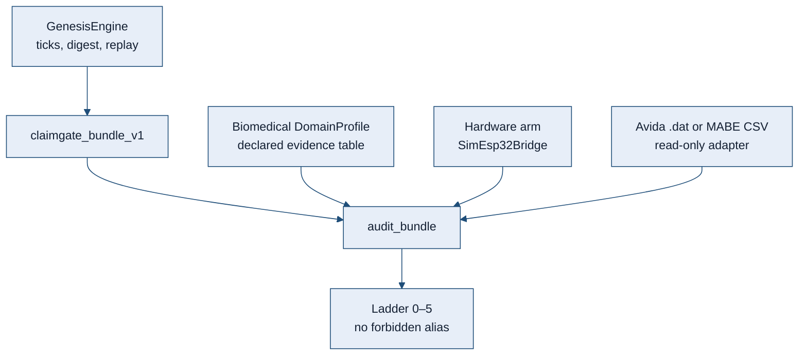

# CodonTrace Genesis

<p align="center">
  <a href="https://pypi.org/project/codontrace/"></a>
  <a href="https://www.python.org/"></a>
  <a href="https://github.com/Parvaz-Jamei/codontrace-genesis/actions/workflows/ci.yml"></a>
  <a href="https://doi.org/10.5281/zenodo.20337435"></a>
  <a href="https://github.com/Parvaz-Jamei/codontrace-genesis/blob/main/LICENSE"></a>
</p>

<p align="center">
  <strong>A world small enough to replay, and a claim strict enough to refuse itself.</strong><br>
  Research software. Not a proof of intelligence, and not a biological result.
</p>

CodonTrace Genesis is a laboratory you can run twice and get the same world back.

You set down a small place. Simple agents eat, survive, and reproduce. The energy of each birth comes out of the parent. The questions are evolutionary: does an antagonist push a lineage somewhere new, does a costly behavior hold its ground, does a line recover after its path is cut. The library exists so those questions can be asked without the answer being talked into shape afterwards. A birth names its parent. A checkpoint is the moment it was taken, not whatever the run became later. A number is stored beside the only scope it is allowed to have.

The aim is not to announce a Red Queen, an open-ended mind, or a medical device. The aim is a digital-evolution engine whose ledgers, forks, and verdicts stay weaker than the temptation to overclaim them. Four words are allowed at the end of a test, and only one of them is support, and only inside the model that was actually run: `SUPPORTED_IN_MODEL`, `FALSIFIED_IN_MODEL`, `INCONCLUSIVE`, `BLOCKED_MEASUREMENT`. On the standing ledger, the Red Queen is not proved.

Domain modules sit beside that life-loop. They do not replace it. The installable package is `codontrace`. Product naming for contributors lives in [`CONTRIBUTING.md`](CONTRIBUTING.md) and [`STYLE.md`](STYLE.md).

---

## How to read a result

A number in this repository is not a conclusion. A standing verdict is one of four words, and only one of them may be attached to a test:

`SUPPORTED_IN_MODEL` · `FALSIFIED_IN_MODEL` · `INCONCLUSIVE` · `BLOCKED_MEASUREMENT`

The single source for the 29 September 2026 program is [`docs/experiments/2026-09-29/VERDICT_LEDGER_V1.json`](docs/experiments/2026-09-29/VERDICT_LEDGER_V1.json). On that ledger `hypothesis_supported` is false and `red_queen_proved` is false. The confirmatory campaign is not open. A green workflow is not a scientific result: the lint and typecheck job is `continue-on-error`, so a green run is not a mypy pass.

| Record | Standing verdict | What the scope actually is |
|---|---|---|
| RQ-1 time shift | `INCONCLUSIVE` | The locked pack still covers imported seeds 5701–5705. Seed 5706’s old log is partial. Seeds 5706–5708 were rerun on the current engine under `confirmatory/closure_2026-10-03/`; that rerun does not complete the locked commit `6187ff4`, which is not in this repository. Those closure files are aggregate summaries with `INCOMPLETE_PROVENANCE`. They are not a raw trajectory pack. |
| RQ-3 adaptation route | `INCONCLUSIVE` | Seeds 21001 and 21011 remain energy-confounded pilots. Seeds 21061–21063 now have current-engine summaries under `closure_2026-10-03/`. On those three seeds the coevolving common-window share ends at 0 and does not beat the frozen arm. The files are `INCOMPLETE_PROVENANCE`: they do not replace the older quotation, and they do not support the hypothesis. |
| D-2 recovery window | `BLOCKED_MEASUREMENT` | The locked 1.25× endpoint for three consecutive boundaries was not reached by the positive control. Zeros on the arms do not falsify an intervention. An earlier `FALSIFIED_IN_MODEL` is retained history, not the standing verdict. |
| Sex-cost bracket | `INCONCLUSIVE` | The measured bracket c* in (1.1, 1.2] belongs only to `infection_cost=0.4`, 400 generations, host cap 400, parasite cap 16, turnovers {1, 6, 12}, seeds 8000–8099. It is not the classical two-fold cost of sex, and it is not a result for other regimes. |
| Causal tape | `INCONCLUSIVE` | A 63–65% share is an estimator label on a synthetic fitness map. It is not an organism-level result. The tested difference is a noise-free mutation-draw intervention: an instrument check, not a do-calculus demonstration on a living population. |

Van Valen’s Red Queen (1973) is the biological hypothesis these records are *about*. None of them establishes it, in the model or outside it. Open-ended intelligence and a Tokyo Type 1 *pass* (Channon 2024) stay blocked. Measurement of a trajectory is not a pass.

---

## Figure style

Figures in this file use one palette. A later diagram should reuse these parameters rather than invent a second visual language.

| Token | Value | Role |
|---|---|---|
| `ink` | `#142033` | Text on a node |
| `rule` | `#1f4e79` | Borders and arrows |
| `wash` | `#e7eef8` | Primary node fill |
| `paper` | `#f3efe6` | Secondary node fill |
| `caution` | `#8a4b2f` | A blocked or non-claim node |
| `face` | `ui-sans-serif, system-ui, sans-serif` | Figure type |
| `size` | `15px` | Figure type size |



The path above is an engineering path. Reaching the last box does not promote the run.



Hurlbert (1984) is the reason a checkpoint is not a second replicate. Granger (1969) is the reason a slope is not a predictive gain: the comparison is a restricted regression on the target’s own lag against an unrestricted regression that also includes the source. This library reports the fractional drop in residual sum of squares. It does not report an F test, and an empty control list leaves the result a `confounded_candidate`.

---

## What the current model refuses to mix up

These are contracts of the software. They are not findings about organisms.

| Contract | What is computed | What it is not |
|---|---|---|
| Energy | A child’s energy is debited from the parent. Maintenance, death, and seat-cap removal are recorded as losses. Without a source, total energy does not rise. | An implicit gift of ATP at birth. |
| Within-class lag | Association after removing the class mean, and after removing a shared trend. The time count is the number of paired times, not classes times times. | The historical pooled Pearson. That score is kept under its own name. A constant mirror can still give correlation −1 and `pass_prelim`. That pass is not temporal evidence. |
| Association | Support requires a real contrast: both sides present, a finite test, and no invented zero for a missing group. | A label of support on an empty cell. |
| Interval | A Student-t critical value from the tail probability. One observation, or a sample with no residual variance, has a point and no interval. A bootstrap percentile may exclude zero for a claim only at the auditor floor of 16 runs, the same floor as ClaimGate level 4. | The old cliff that used 1.96 once the degrees of freedom passed 30, or a one-run interval treated as evidence. |
| Experimental unit | `(history_id, seed)` identifies the independent history block for one estimand. Run aliases and later checkpoints do not add replicates. Different interventions require separate reports or an explicitly designed dependent analysis. | Renaming runs or interventions to turn one history into sixteen independent replicates. |
| Prediction | Fractional SSE reduction against the target’s own lag. `tested_lags` lists only lags that were fit. | The absolute slope of the source, or a causal claim. |
| Time-shift archive | The feature map is a proxy over a private copy. Reads recompute the digest. Replacing a tick requires `revise(reason=...)` and keeps the superseded snapshot. | A frozen dataclass whose dict can still be edited, or a silent overwrite of history. |
| Checkpoint | State is frozen at capture. Restore checks seed, spec digest, and payload version. `exact` is true only when the frozen continuation matches. | A live reference to the parent, or a digest that ignores a field the resume can still change. |

The historical estimators stay in the tree so an old number can be reproduced and then not reused as the corrected estimand. A locked WAVE classifier that still reads `pass_prelim` does not set `red_queen_proved`.

---

## What it is

- A Python research library for controlled digital-evolution and artificial-life experiments.
- A replay and audit layer: specs, runtime digests, manifests.
- Mechanism instrumentation: ablations, treatment and control, delayed outcomes.
- A claim-gated workflow. A software capability and a runtime observation are allowed. A strong scientific conclusion is not auto-promoted.
- One biomedical port and one hardware arm on that same auditor. Further modules attach without a second engine.

## What it is not

CodonTrace Genesis is **not** currently presented as:

- proof of artificial general intelligence, consciousness, or collective intelligence
- proof of open-ended intelligence, or a Tokyo Type 1 *pass* (Channon 2024)
- a biological evolution simulator or a wet-lab chemistry engine
- a replacement for Avida (Ofria and Wilke 2004), MABE, DEAP, QDax, or pyribs
- a physical-robot platform (`SimEsp32Bridge` is an engineering stub)
- a medical device, SaMD, IVD, FDA or CE clearance, or an ASME V&V 40 certification
- an Avida or MABE campaign runner (those ClaimGate adapters stay skeletons until audited published tables exist)

Claims have to pass evidence gates. See [`CLAIMS.md`](CLAIMS.md) and [`docs/WHY_NOT_INTELLIGENCE_YET.md`](docs/WHY_NOT_INTELLIGENCE_YET.md).

---

## Status

| Field | Current status |
|---|---|
| Package | `codontrace` |
| Public PyPI wheel | `0.3.0b27`, tag [`v0.3.0b27`](https://github.com/Parvaz-Jamei/codontrace-genesis/releases/tag/v0.3.0b27). Cuts `0.3.0b4` through `0.3.0b20` are not recut. |
| GitHub `main` | `0.3.0b27`, the `[project].version` in `pyproject.toml`. |
| Python | 3.11–3.14 |
| DOI | [`10.5281/zenodo.20337435`](https://doi.org/10.5281/zenodo.20337435), the software archive, not a campaign archive |
| License | AGPL-3.0-or-later |
| HE01 | SCHEMA v7 locked. Ceiling at most `intervention_supported` when the full rule holds. |
| HE02 | Research null after analysis v1b. Ceiling stays `runtime_observation`. |
| HE03 | Code and preregistration are present. `results_v1` is absent on purpose. |
| Claim ceiling | Research software and evidence infrastructure. |

### Phases A–L

Phases A–G are the earlier `0.3.0b3` substrate. Phases H–L, HE01 SCHEMA v7, and the discovery ClaimGate pipeline shipped in public `0.3.0b4`.

| Phase | What landed | Ceiling |
|---|---|---|
| **A** | Darwinian life-loop (`life_loop_world`: eat, survive, asexual reproduction) | `runtime_observation` |
| **B** | Sexual recombination, opt-in; defaults stay asexual | `runtime_observation` |
| **C** | Fluctuating environment: chemostat, regimes, patches | `runtime_observation` |
| **D** | Multi-generation evidence; Tokyo Type 1 *measurement* only | `oee_measurement_only` |
| **E** | Capsule, memory, role, and deme substrate, opt-in | `runtime_observation` |
| **F** | Multi-seed deme payoff; division-of-labor *metrics* | `runtime_observation` |
| **G** | Named-materials overlay, opt-in | `runtime_observation` |
| **H** | Literature retrieval; communication-ablation and group-versus-individual harnesses | `runtime_observation` |
| **I** | Held-out partners; evolved division of labor; multilevel outcome; export-of-fitness scaffold | `runtime_observation`; smoke never earns a flag |
| **J** | Independent digest replay; Price-equation scaffold | `collective_intelligence_candidate` only with the full honest flags, including replay |
| **K** | Coordination-instruction analog; CPU-delay harness; conflict-suppression hooks | `runtime_observation`; smoke never earns |
| **L** | Analogs of Avida messaging and deme groups | `runtime_observation`; an analog, not an Avida port |

Still blocked: bare `collective_intelligence`, `intelligence`, AGI, `tokyo_type1_passed`, and Avida replacement. Smoke never sets ClaimGate flags. Digests are never invented.

---

## Installation

Python 3.11–3.14. CI smokes Ubuntu, Windows, and macOS on that range. The published wheel is `codontrace==0.3.0b27`. An editable install of `main` prints `0.3.0b27`.

```bash
pip install codontrace==0.3.0b27
```

```bash
pip install "codontrace[research]==0.3.0b27"
pip install "codontrace[causal]==0.3.0b27"
pip install "codontrace[qd]==0.3.0b27"
```

From source, which may be ahead of PyPI:

```bash
git clone https://github.com/Parvaz-Jamei/codontrace-genesis.git
cd codontrace-genesis
python -m pip install -e ".[dev,research,causal,qd]"
python -c "import codontrace; print(codontrace.__version__)"
```

Do not treat the version tuple as a phase fence, and do not tag or publish from a red or queued CI.

---

## Quick start

The beginner API returns the agent, the world, the trace, and an optional explanation.

```python
from codontrace import WhiteBoxAgent, World2D

world = World2D.from_ascii("""
....
.A*.
....
""")

agent = WhiteBoxAgent.from_world(world, genome="101111000", initial_atp=5.0)
result = agent.run_trial(world, steps=3, explain=True)

print(result.agent.position)
print(result.explanation.summary if result.explanation else "no explanation")
```

A research run uses an explicit spec. Empty research defaults are not a life-loop: `ResourceConfig.density=0` and a same-cell reproduction rule do not make a Darwinian substrate. Use the preset.

```python
from codontrace.genesis import GenesisEngine, GenesisRuntimeProfile

spec = GenesisRuntimeProfile.life_loop_world(seed=7, tick_count=12, population=6)
result = GenesisEngine.from_spec(spec).run_ticks()
print(result.digest()[:24])
```

Opt-in presets (sexual recombination, fluctuating environments, multi-generation measurement, materials, and the H–L harnesses) stay off unless requested, so earlier digest pins remain stable. Print-only smokes live under [`examples/`](examples/).

---

## Console

The console is a local preview module. It does not run the evolution engine, it does not execute an uploaded `.py` file, and it does not set `red_queen_proved`. A gate row is the catalog plus the latest preview in the browser, not a pytest pass. On startup, and again every 24 hours, it asks GitHub whether a newer release exists. That query does not push. A clean checkout of this repository can fast-forward; a wheel install is left as it is.

The same command works on Linux, Windows, and macOS after a normal install. No extra package and no Node process are required to open the page.

```bash
python -m codontrace.console
```

The default address is `http://127.0.0.1:8765/`. `--host` and `--port` change the bind. `--open` asks the desktop to open the page. Workers stay in 1–4. A temperature is reported only when the machine exposes a sensor file. Windows does not have a load average, so that field stays unmeasured there.

The page source lives in [`console/`](console/). Rebuild it with Node only when the interface itself changes; the result is stored under `src/codontrace/console/static` and shipped inside the wheel. The server is `codontrace.console` and does not import `engine.py`.

---

## Claim policy

| Level | Meaning |
|---|---|
| Software capability | The mechanism, API, or record exists and is tested. |
| Runtime observation | It was observed in a valid run. |
| Candidate evidence | A treatment and a control exist. |
| Mechanism support | Ablation, intervention, or a counterfactual comparison supports a mechanism *in the model*. |
| Replicated effect | The effect is stable across enough independent units. |
| Publication-grade claim | Archived artifacts, a pre-registered analysis, controls, and limitations are all present. |

`ScientificClaimGate` can allow `collective_intelligence_candidate` only when the full honest flag set is present, including replay. It does not allow bare `collective_intelligence`, `intelligence`, AGI, `tokyo_type1_passed`, or Avida replacement. Policy: [`CLAIMS.md`](CLAIMS.md). Ladder: [`docs/protocol/CLAIM_LADDER_PROTOCOL_v0.1.md`](docs/protocol/CLAIM_LADDER_PROTOCOL_v0.1.md).

---

## Architecture

The product is the engine. It does not know medicine or hardware. A new module is a `DomainProfile` or an adapter. It is not a copy of the engine.



| Port | What it ingests | Does it run the engine? |
|---|---|---|
| Native campaign | A live spec, or HE01 / HE02 / HE03 JSON | Yes, when a spec runs. A JSON adapter only reads the artifact. |
| Avida `.dat`, MABE2 CSV | Foreign run tables | No |
| Biomedical `DomainProfile` | Question of interest, context of use, risk, and a PIRT worksheet | No |
| Hardware | `SimEsp32Bridge` today | Optional |

`ALIFE` is the default profile. `BIOMEDICAL` and `HARDWARE` are the two extra profiles that ship now. The biomedical port stores ASME V&V 40, FDA 2023, IEC 62304, and IMDRF wording as **labels**. It ranks a phenomena table and caps a coupled model at its weakest submodel. A study file closes a phenomenon only when that arm was executed. A typed rank does not. Declared model risk has its own bar. The bar does not move the claim ladder. Strings such as `asme_vv40_passed`, `fda_cleared`, and `samd_certified` raise `ConfigurationError`. This is not SaMD.

```python
from codontrace.claimgate import audit_bundle
from codontrace.claimgate.adapters.codontrace import bundle_from_hard_experiment_01

report = audit_bundle(bundle_from_hard_experiment_01())
print(report.achieved_level, report.public_name, report.missing_for_next)
```

```python
from codontrace.claimgate import audit_bundle
from codontrace.claimgate.adapters.biomedical import bundle_from_device_model_cou

bundle = bundle_from_device_model_cou(
    question_of_interest="Would this score table support the claim?",
    context_of_use="Declared table only; no implant.",
    model_influence=2,
    decision_consequence=3,
    treatment_scores=(0.12, 0.11, 0.13),
    control_scores=(0.20, 0.19, 0.21),
    device_software_kind="simd_declared",
    iec_62304_class="B",
    imdrf_n12_category="II",
    fda_2023_evidence=(1, 3, 8),
    physics_based=True,
)
print(audit_bundle(bundle).achieved_level, bundle.extra["domain"], bundle.extra["model_risk"])
```

The second call stays on the biomedical port. It does not start the engine. Map: [`docs/ARCHITECTURE_PORTS.md`](docs/ARCHITECTURE_PORTS.md). Biomedical scope: [`docs/BIOMEDICAL_ENGINEERING.md`](docs/BIOMEDICAL_ENGINEERING.md). Replay contract: [`docs/ENGINE_REPLAY_CONTRACT.md`](docs/ENGINE_REPLAY_CONTRACT.md).

---

## Documentation

| Document | Use it for |
|---|---|
| [`CLAIMS.md`](CLAIMS.md) | Allowed, candidate, and blocked claims |
| [`docs/WHY_NOT_INTELLIGENCE_YET.md`](docs/WHY_NOT_INTELLIGENCE_YET.md) | Why the literature gap is not a near miss |
| [`docs/PHASE_INDEX.md`](docs/PHASE_INDEX.md) | Pointers for phases H–L |
| [`docs/CLAIMGATE_STANDALONE.md`](docs/CLAIMGATE_STANDALONE.md) | Simulator-agnostic auditor, public levels 0–5 |
| [`docs/SCIENTIFIC_AUTHORITIES_2026.md`](docs/SCIENTIFIC_AUTHORITIES_2026.md) | Feature against authority: landed, partial, deferred |
| [`REPRODUCIBILITY.md`](REPRODUCIBILITY.md) | Install, validation tiers, artifact preservation |
| [`BENCHMARKS.md`](BENCHMARKS.md) | Benchmark protocols and the claim boundary |
| [`RELEASE_EVIDENCE.md`](RELEASE_EVIDENCE.md) | Which public wheel an evidence pack covers |
| This file, [Orange Pi Zero 3 long program](#orange-pi-zero-3-long-program) | Design for T01–T12. Not a runner, and not a verdict. |

The benchmark smoke is a functionality check. It is not evidence of collective intelligence.

```bash
python -m pytest tests/examples/test_collective_joss_evidence_benchmark_smoke.py -q
```

---

## Orange Pi Zero 3 long program

This section is a design and an acceptance spec, dated 10 October 2026. It is not a runner, not a command, and not a result. Nothing in it has been executed on the board, and no board rate has been measured. It does not amend the 29 September 2026 ledger above. On that ledger `red_queen_proved` stays false.

If a later campaign earns a reading, it uses its own four words, and only those: `SUPPORTED_IN_THIS_MODEL`, `NOT_SUPPORTED`, `INCONCLUSIVE`, `INVALID_MEASUREMENT`. They are not aliases of `SUPPORTED_IN_MODEL`, `FALSIFIED_IN_MODEL`, `INCONCLUSIVE`, and `BLOCKED_MEASUREMENT`. A long clock, a large population, or a large diff is not a discovery. A valid positive result is accepted. A valid negative result is also a result. Fix a technical fault. Do not fix an unwanted number.

The four hypotheses named from [`scripts/grand_frontier_4challenge_campaign.py`](scripts/grand_frontier_4challenge_campaign.py) are `OEE_NOVELTY`, `MLS_PRICE`, `TRANSITION_MUTUALISM`, and `CONTINGENCY_REPLAY`. Red Queen, functional information, and engine-capability questions are separate additions. If "the four hypotheses" meant another set, the manager reconciles the names before the campaign is locked.

The review behind this section read remote HEAD `bf5439355c3c378422b51b6c752156b5d9e5363c`. The scientific tree then matched `b836396502b4a8f102f5e9d6944d8d773b1d2677` except one line of panel model-path discovery. Commits after that instant are outside the review. Before code moves for an experiment, refresh HEAD and work on a clean checkout at a named SHA. A fetch is not a merge. After the lock, that experiment’s version does not move.

### Three paths, kept apart

| Path | What actually runs | Claim that path may carry |
|---|---|---|
| `REFERENCE` | An independent mathematical model, such as the current four-challenge campaign | Behavior of that model, a check of a measure, a reproduction of a theory |
| `ENGINE` | GenesisEngine, with organism, translation and action, ecology, and real reproduction | Behavior and capability of one named engine version |
| `INTEGRATED` | A recorded attachment of a submodel to the engine, with a real exchange of data or effect | Behavior of the integrated system, with evidence of the attachment |

A `REFERENCE` output is never introduced as use of the engine’s facilities. The manifest records `engine_backend`, the runner class, and the call path. A capability with no consumer is `NOT_IMPLEMENTED`. A config field does not mean the feature is on.

The notes below are what a reading of that script requires before the same campaign can be interpreted. They are not a reason to rewrite the project.

1. **OEE.** `_match_count` is computed and is not consumed by selection, reproduction, or survival. Host and parasite populations currently change by mutation, and that loop is not evidence of selective coevolution. "Cumulative activity" also rises when an old part is seen again. A positive slope is not, by itself, novelty. The two-byte genome is a finite space. Draw the mutation event and the mutation site from separate random numbers. Re-using the same conditional draw as the site biases the distribution.
2. **MLS.** A positive between-group term can come from a fitness formula that was written to produce it. Check the Price identity with the realized offspring count, and keep transmission and mutation in the account. Mutation noise for individuals who share an index, in the same generation, currently comes from the same key in every deme. The random key includes deme and lineage, unless that correlation is itself the experimental variable.
3. **Transition.** The current model is `w_h = 1 − 0.85u` and `w_p = 1.2(1−v)u + 1.5v(1−0.85u)`. The slope of parasite fitness in harm `u` is `1.2 − 2.475v`, and it changes sign near `v = 0.484848`. A positive correlation past that point can be algebra. Host fitness beside the parasite also does not rise above the baseline of 1, so less harm is not yet mutual benefit. Record generations per regime. In the present loop each regime takes about `epoch_gens / 5` steps while the shared counter still advances by `epoch_gens`.
4. **Contingency.** The present loop has no selection and no functional fitness. Genomes mostly mutate. Under `r < 0.18`, `int(r * 32)` only reaches sites 0 through 5, so the 32 bits are not uniformly mutable. The founder is built from a fixed string. `founder_seed` changes the future stream, not the founder. Genetic distance, and a threshold of 0.25, are not by themselves evidence that an innovation depended on history.
5. **Every path.** Selectable seeds, a locked manifest, a checkpoint that includes the generator and the measure, an uninterrupted run compared with resume, and an independent analysis. A clock is a fit ending for an endurance test. A scientific comparison needs the same biological horizon, or the same number of evaluations.

### Before a long run

Build one `literature_review.md` per experiment: at least one foundational source and two works close to the question, a search of recent work up to the start date, DOI or URL, the date consulted, whether the item is a paper or a preprint, the exact definition of the measure, and how the proposed contrast differs. Count is not quality. Use the original text and method. An abstract, or a model’s paraphrase, is not enough for a detailed claim. If nothing recent is relevant, write that down. Do not add a fresh source that does not bear on the question.

Before calling a result an innovation, read the nearest work in artificial life, evolutionary biology, learning, and control or robotics. A cross-field mix has to produce a distinct question or prediction. Using a known tool is not novelty. This design does not claim that nobody has done the work before.

Every measure, before the long run, passes a constructed positive control, a zero control, and a counterexample control. Synthetic data stay in `SYNTHETIC_CONTROL` and do not enter the engine inference. An uncertain descriptor is computed from raw data by a versioned extractor, not from an alias: genome length from the genome, accuracy from correct over attempts, graph size from the graph.

### Size

These profiles are design proposals. They are not a present API, and they are not a claim about how long the board takes.

| Profile | Independent repeats | Default horizon per arm | Population / ticks per generation | Use |
|---|---:|---:|---|---|
| `CALIBRATION` | 2 to 4 separate seeds | 100 to 200 generations | the final proposed size | Speed, memory, and tool correctness. No confirmatory result. |
| `LONG` | 24 paired seeds | 2,000 generations | 96 / 16 | The main engine campaign. Controls spend the same budget. |
| `ULTRA` | 24 new seeds | 6,000 generations | 96 / 16 | Long-run stability on arms named before the run, in a fresh cohort. |
| `REFERENCE_LONG` | 24 seeds | 100,000 generations | the model’s own size | The fast reference model only, with its full controls. |

Experiments with a different size say so in their own block. Twenty-four seeds are not a power guarantee. The smallest effect that would matter, and the pilot variance, are checked before the horizon is confirmed. If the budget is short, drop questions first. Cutting the repeats to 12, before the confirmatory result is seen, is allowed only with an exploratory label. One seed run for a million generations does not stand in for 24 repeats.

On `LONG`, four arms and 24 seeds are `24 × 4 × 2,000 × 96 × 16 = 294,912,000` action opportunities. Real time also includes unequal action costs, snapshots, reproduction, and analysis. All twelve experiments on one board are not one 72-hour campaign. They may take several weeks or longer. Measure the time. Do not promise a calendar.

Calibrate on the board with the RAM that will actually be used, and with the final cooling, for 60 to 120 minutes. Record cost per generation and per action, RSS of every process, archive growth, IO, temperature, and throttling. Estimate the campaign from seeds × arms × generations × mean generation time. Do not estimate by assuming four workers make the run four times faster. Leave time for the record and for stop and resume.

Before the scientific endpoints are looked at, the manager locks one size that can be finished. If 2,000 generations do not fit, change the horizon beforehand, or run fewer experiments at once. Do not call a partial run complete. If time is left over, run only a pre-registered extension, or a fresh cohort.

Start with two compute workers and one light analyst. After calibration, raise the count only to the CPUs the machine actually allows. Do not hard-code a universal cap of four cores in a general runner. A Zero 3 usually has four cores of hardware, but the allowed affinity is read from the system and checked after it is applied. Each worker holds one active seed and arm. BLAS and OpenMP stay at one thread, so the process tree does not nest. The interface and any local model do not spend the experiment’s RAM without an account.

Compared arms share a biological horizon. Wall time and energy are outcomes, not ways to equalize the work. The seed and arm order is a random queue locked in advance, so day, temperature, and clock do not mix with the treatment.

### Inference, and when a run may stop

- The independent unit is the seed, or the founder. A thousand generations are not a thousand independent repeats. Arms of one seed share the founder and use named random streams. Where action order differs, share randomness on the meaningful event, not on a raw random index.
- Each experiment locks one primary endpoint, a direction, a minimum effect that would matter, a time window, and the main comparison. The effect threshold comes from the problem, or from the pilot. It is not taken from the confirmatory result.
- Intervals are at seed level. A paired effect uses a permutation or a sign flip only when exchangeability fits, or a bootstrap of the seed pairs. In the contingency design, replays are clustered inside the founder. A time series uses a block or a model that respects the series. Generations are not treated as independent.
- For the twelve primary questions, the family and the multiplicity rule are registered first. The default for the full campaign’s primary endpoints is Holm. Diagnostics, and extra interactions, stay exploratory. Choosing the successful arm or the successful seed after the fact is not allowed.
- Report the effect and the interval beside any p-value. A small p-value does not by itself establish a mechanism, a large effect, or novelty. A second person re-runs the statistical model and the sensitivity check.
- Engineering status and scientific status are different fields. No hard-coded false, and no hard-coded true, replaces the evaluator.
- Every ten minutes, check automatically that the worker is alive, that progress is real, that the output parses, and that RAM, disk, the generator, the checkpoint, temperature, and throttling are inside the registered limits. Stop for a bug, for broken data, or for a hardware limit that was written down. Do not stop, and do not edit the engine, because a plot looks weak or a p-value is large.
- Read temperature limits from the board’s documentation and from the system policy. Do not invent one number for every board. Near the limit, drop a worker and record the event. Answer a RAM shortage by bounding the compute memory. Silent dropping of raw data is not allowed.
- If a bug can change results, record the cause, the diff, the old data, and how far the contamination reaches. Re-run the affected confirmatory arms from the start, on the new version, under a separate version id. Do not load an incompatible checkpoint in silence. A valid negative result does not need a fix.

### T01 — functional novelty that outlasts mutation turnover

Does ecological selection, together with a diversity archive, produce functional solutions that still work in environments they were not trained on, or does it only count different genomes and old parts?

`ENGINE`, with a separate `REFERENCE` null for the activity measure. Profile `LONG`. An `ULTRA` extension, if it is run, covers every primary arm in a fresh cohort, not only the best seed. Four arms: real selection without quality-diversity; real selection with it; neutral mutation and reproduction on the same budget, with fitness not in the loop; quality-diversity whose descriptors are random, as a control that keeps the same distribution. The random arm matches the real archive’s occupancy and the number of evaluations.

The environment is a pre-registered, fixed distribution of tool, routing, and resource problems. Held-out families are separated before training. Do not raise difficulty after seeing success. If a curriculum is used, its schedule does not depend on the result, and it is the same on every arm. A task that the experimenter inserts is not spontaneous innovation.

Record genotype, functional phenotype, first appearance, later reappearances, share of active generations, lineage, and held-out retention. Genetic, behavioral, and functional novelty stay separate. Seeing an old part again is not a new first appearance. Genome length is not functional complexity.

**Primary endpoint.** Area under the curve of the count of valid functional phenotypes on the held-out set, in the second half of the campaign, against the arm without quality-diversity. Each phenotype has a locked behavioral definition and an independent check.

**Secondary.** Rate of valid first appearances in four quarters, activity normalized against the null, extinction, archive saturation, and compute cost.

**Measure controls.** A constructed cycle of only repeated parts scores zero novelty, even if cumulative activity is high. A stream with a genuinely new phenotype is detected. A finite space can saturate. The allowed scientific sentence is "stable novelty over horizon X". One finite run does not prove that novelty continues forever.

### T02 — multilevel selection with real reproductive accounting

Can a group advantage pay the individual cost of cooperation and produce roles that transmit?

`ENGINE`, with real demes and real parent–offspring generations. If group generations do not exist yet, run `REFERENCE` and keep the claim inside that model. Population 128, as 8 demes of 16, for 2,000 generations and 24 founders. A 2×2: between-group selection on or off, crossed with low or high migration. Lock the migration rates from the pilot and from the sources. The off arm still replaces groups at random, at the same count.

Cooperation costs real ATP or time, and it contributes to a shared product or to survival. A role is behavior that ran, not a threshold label on a trait. Record the role, the share of work, the benefit, individual offspring, and group offspring.

For each generational transition, with `w_i` the realized offspring count, `z_i` the parent trait, and `z'_i` the mean trait of that parent’s offspring, the controlled identity is:

`Δz̄ = Cov(w, z) / w̄ + E[w (z' − z)] / w̄`.

Split the covariance, with the correct weights, into between-group and within-group parts. The parts, together with transmission, mutation, and the sampling rules, reconstruct the observed change. Do not hide mutation inside the residual. If generations overlap, or migration is more complicated than the identity assumes, derive the identity that matches that model. Record formula fitness before selection separately from offspring that were actually born.

**Primary endpoint.** Difference in mean functional cooperation over the last 500 generations, between group selection on and off, at low migration. The migration interaction is secondary. The individual cost, and the share of group production, are the mechanism evidence.

**Controls.** No cooperation cost. No shared benefit. Random groups of the same size. An accounting fixture with a generation that does not mutate, and one that does. The numerical residual stays inside a tolerance matched to the arithmetic. The tolerance does not hide a statistical mistake.

A positive covariance inside a formula that was designed to be positive is not the whole result.

### T03 — from less harm to mutual benefit and collective inheritance

Can vertical transmission and a real coordination cost produce mutual dependence and a collective reproductive unit?

`INTEGRATED`, or `ENGINE`, with a real interaction and transmission contract and with group offspring. The current harm model is only a theoretical baseline. Twenty-four founders, 2,000 generations, population 96. An exploratory screen at vertical-transmission rates 0, 0.25, 0.5, 0.75, and 1. Then three rates, chosen and locked before the main stage, crossed with two cooperation costs. Screening seeds do not enter the confirmation.

To call the relation mutualism, assay host and partner at generations 500, 1,000, 1,500, and 2,000, on the same resources, in four conditions: the real partner; the partner removed; a non-cooperating partner at the same cost; partners mixed at the same count. Removal does not quietly change the resource inputs. Separate the immediate effect of removal from adaptation after removal.

**Primary endpoint.** Probability that a mutually beneficial partnership is still intact at the end, against the locked transmission-rate baseline. Mutual benefit means both sides, in the standard assay, do better than a no-relationship baseline or a valid control. Reduced harm is a separate measure.

A claim of a transition in individuality needs, in addition to mutualism, reproduction of a collective unit, transmission of collective traits, dependence of the parts, and a response to selection at the collective level. A fitness correlation, different roles, or less harm is not enough. Each condition has its own output. If only mutualism is supported, accept that and stop there.

**Controls.** A formula surrogate must show the sign change at the algebraic boundary, and it is labeled calibration. Remove collective reproduction while keeping the interaction. Scramble partner inheritance while keeping the transmission rate. Control resources and cost. A "positive control" that builds the transition into the model only tests the measure.

### T04 — replay history, with founder, chance, and environment taken apart

Does an agent’s past change the probability of reaching a functional innovation, when the future environment is the same?

`ENGINE`, with a real fork. Twelve independent histories. Snapshots at generations 0, 500, and 1,000. Eight independent future streams from each snapshot. Each branch runs 1,500 generations. That is 288 branches, not 288 independent founders. Execution order is randomized. The future environment is held fixed across the comparisons. The checkpoint includes genome, memory, policy, generator, ecology, and archive. Anything omitted is named as the intervention.

First, a deterministic replay of the same snapshot and the same generator must match. Then change only the future generator. In separate interventions, clear or randomize memory or knowledge, and keep energy, size, and maintenance cost matched. Delete specified background genes only under a controlled assay, and record side effects.

**Primary endpoint.** Difference in the probability of reaching the locked held-out function between early and late snapshots, clustered at founder level. The same performance, or the same phenotype, can sit on different genomes. Hamming distance is diagnostic only. Separate future chance from historical effect with a hierarchical model, or with a permutation that respects the founder structure.

**Controls.** A neutral model with the same mutation, for genetic divergence. A task with one answer, to detect convergence. A task with several paths, to detect contingency. A uniform generator with an independent stream for the mutation site. Do not mistake the effect of clearing memory for a loss of energy.

Eight random walks diverging is not enough evidence that an innovation depended on history.

### T05 — Red Queen: time shift and two-sided causation

Does change in each population create selection on the other, and does a pre-registered temporal pattern of adaptation appear?

A real host–parasite submodel, with the backend boundary written down. If it is not attached to GenesisEngine, the result belongs to that submodel. Twenty-four seeds, 4,000 generations, a snapshot every 10 generations. Assay sampling every 40 generations, at lags 20, 40, and 80, with 40 as the primary lag. If the pilot shows a faster cycle, shorten the save interval before the lock. These settings do not guarantee a cycle.

Four arms: two-sided coevolution; frozen parasite; frozen host; selective interaction cut, while the recorded contact load and cost are kept. If the benefit of exchange is being measured, exchange on or off is its own factor, with matched pairing. Do not attribute a mating difference to exchange.

The raw matrix `M(t_h, t_p)` is built from real resistance or infection, on a matched budget. Past, present, and future of both sides are tested against one fixed standard. Exposure, resources, and contact counts match. A time-shift result depends on how the score is defined. Take the direction of the contrast from the locked model and from calibration.

**Primary endpoint.** The paired two-sided temporal contrast on the coevolution arm, against the one-sided frozen controls. For a cyclic model, pre-register a lag or phase contrast. For an arms race, pre-register directional escalation. One of those is primary. The other is exploratory. A frozen control need not put every measure at zero: the side that still varies can adapt to the side that is held still.

**Secondary.** Gene or trait frequency, diversity, lag and autocorrelation, extinction, and a spectral analysis against a null with the same autocorrelation. Oscillation alone is not a Red Queen. Beating ancestors is only one signature. A valid positive result is evidence for the Red Queen in the named model and regime, and it is accepted without resistance. Do not turn parameters until the p-value shrinks.

### T06 — whether knowledge and the ledger causally earn their survival

Does ledger information, or a causal model, actually change decisions and survival, or is it only printed?

`ENGINE`, with a real consumer of knowledge in the decision or in the resources. An observer-only log is not enough for this claim. Profile `LONG`, 24 seeds, four arms: real knowledge; the relevant causal edge cut; a random cut of the same count and degree; a sham that does not change the information. If the match is two edges, both controls remove two edges. ATP, time, memory volume, and log overhead stay matched.

The environment has a training confounder and a held-out change. A color cue can correlate with the resource in training and then move at evaluation. The true causal relation is known only to the measure-control, and hidden from the agent. The engine sees only the observations and actions it is allowed to see, not the simulator’s answer table.

**Primary endpoint.** Success in the intervention or held-out environment: real knowledge against the targeted ablation, and against the matched control.

**Secondary.** Survival area under the curve, and ATP per success. The log has to show `ledger change → decision or resource change → outcome`. If the ledger acts only by changing ATP, the claim is a resource-feedback effect. "The agent used a causal model" requires that the knowledge was consumed when the action was chosen.

### T07 — capsule transfer, inherited skill, and social role

Does transferred knowledge shorten learning of a new problem, or does it only hand over extra facilities or extra ATP?

`ENGINE`, profile `LONG`, 24 seeds. A 2×2 of transfer on or off, crossed with valid or shuffled content. The off arm pays a sham transfer cost. Choose the knowledge source by training performance. The hold-out must not appear in the capsule, or in a prompt.

Every 400 generations, introduce a new task from a table locked in advance, and record evaluations until the success criterion. Record donor to receiver to child by a content hash before and after, by adoption, by action bias, and by the action that actually ran. If a policy is built and never consumed, the run is invalid for this hypothesis.

**Primary endpoint.** Evaluations until the locked functional criterion on the transfer tasks, with censoring of failures and extinctions.

**Secondary.** Retention after transfer, lineage effect, harm from invalid knowledge, real specialization, and total ATP. A named role with no behavioral difference is not division of labor.

### T08 — skill compression and the energy account

Does an automatically defined function, or skill composition, improve transfer to an unseen problem per unit of real energy?

`ENGINE`, 24 seeds, 3,000 generations. A 2×2 of the macro facility on or off, crossed with low or ordinary energy budget. Lock the budget and the price of each action in the pilot. The off arm has the equivalent primitive sequence and the same information. Count discovery, expansion, memory, and action execution. A macro that only hides the action account is not a real saving.

**Primary endpoint.** Functional success on the held-out set per real ATP. Report success and ATP separately, so a small denominator cannot flatter the ratio.

**Secondary.** Real trace length, reuse taken from the execution log, the speed and memory trade, and inheritance of the macro. Removing or expanding the macro from a snapshot, then assaying again, is the evidence that the result depended on it.

### T09 — functional information in a defined reference space

How does the probability of a specified function, in a fixed genome or program space, change under evolution, and how much does that number depend on the choice of reference space?

`ENGINE` for the real function, and an independent sampler for the estimate. Twenty-four seeds, 2,000 generations, selection against neutral. At generations 0, 500, 1,000, and 2,000, assay a representative phenotype under a pre-registered rule. At least 10,000 independent reference samples for each primary definition of the space. If one reference pool is shared across thresholds, record that statistical dependence.

`I(E) = −log2 F(E)` is defined only when the space, the length, the sampling distribution, and the threshold `E` are specified. A local neutral network around an elite is not a uniform sample of the whole space. If genome length changes, use spaces conditioned on length, or a length distribution fixed in advance. Do not compare `I` directly across two different spaces.

**Primary endpoint.** Change in that defined functional information, in a fixed reference space, against the neutral arm, with a sampling interval and a between-seed interval. Local and global information stay separate. Zero successes in `N` samples do not mean the probability is exactly zero: an upper bound on `p` is a lower bound on `I`. The "rule of three" is only an approximation for independent identically distributed Bernoulli trials under a suitable sampler. Prefer an exact binomial, or the method that matches the sampler.

### T10 — ecological adjustment, collapse, and recovery

Do diversity and knowledge transfer increase resistance and recovery under a real environmental shock?

`ENGINE`, profile `LONG` with a horizon of 3,000 generations, 24 seeds. Arms: baseline, quality-diversity only, transfer only, and both. First shock at generation 1,000: a resource cut at a locked intensity. Second shock at generation 2,000: the resource geography changes. Every arm sees the same schedule. Chemistry or an element grid enters only if consumption and production are real inputs to behavior.

**Primary endpoint.** Area of the drop in functional output, relative to the pre-shock level, over generations 1,000–1,500. Extinction is its own event. A failed recovery is censored, or otherwise defined, and an extinct seed is not dropped from the mean.

**Secondary.** Time to recover, diversity, resource use, migration, and the effect of the second shock.

A positive recovery control, in a world whose replenishment is known, has to show that the measure can detect recovery. Check conservation of energy or materials, and the input–output account, inside a numerical tolerance. A clean account and a scientific effect are two separate conditions.

### T11 — endurance, replay, and equivalence on ARM

This one asks whether the engine, over multi-day runs, through stop and resume, and under interface load, keeps the data and the behavior. It is not, by itself, a biological discovery. It is what makes the other experiments interpretable.

`ENGINE`. Seventy-two continuous hours for each of three workloads: ecology and reproduction; memory, macros, and transfer; quality-diversity and the ledger. Repeated seeds compare an uninterrupted run with resume. The cuts are controlled, at checkpoints chosen in advance. Do not pull power without a file-protection protocol. Inject crashes only on an isolated test path.

Compare at the same horizon: one continuous run, pause and resume, restart from a checkpoint, and workers at 1, at 2, and at the allowed capacity. Parallel independent seeds must not change the result of a seed. Parallelism inside one simulation is a separate contract. Compare a canonical state hash that excludes timestamps and process ids. Register exact-or-tolerance for floating point before the run. Do not hide an architecture difference inside a tolerance chosen after the difference is seen.

Every 60 seconds record RSS, CPU, IO, temperature, throttle, cache and archive and abort-set sizes, the command queue, and display lag. Bounded memory means the live structures do not grow without a bound, an eviction policy exists, and the memory curve shows it. A flat line over two hours is not a proof about three days.

The interface tester issues pause, resume, and stop with a session and a `command_id`. The acknowledgement comes from the worker and from the real tick, not from writing a file. Percent complete is finished work over the work that was asked for. Endurance clock progress is shown separately. An old verdict must not cover a new run after a refresh. The live log is not the final scientific record. The sealed raw artifact is.

The campaign surface, once this program is implemented, shows the active seed and arm, generation against target, finished seeds against the total, an approximate ETA with its method, worker health, RAM and temperature, the metric plot, and a link to the raw record. Provisional rows are labeled `RUNNING — UNSEALED`. The public title is `Genesis Experiments`. Cards are not named by a frozen Red Queen flag. Show the hypothesis name and the assessment that was actually reached. This paragraph does not describe the local preview console, which still does not run the engine.

If a second machine, including x86, is available, run the same workload on the recorded CPU and version. Without that machine, do not claim ARM and x86 equivalence. Measure efficiency per equal work. Report power only from a meter or from valid telemetry, not from a CPU percentage.

### T12 — a long-horizon swarm and control task

Does the engine’s learning or logic path solve a realistic task, under delay, failure, and missing information, better than simple policies?

`ENGINE`, inside a controlled environment simulator. One locked task: collect resources with 8 to 16 agents, a battery limit, a return to station, limited messages, obstacles, and sensor failure. Lock the task, the action interface, and the costs before the run. Train for 2,000 generations on 24 seeds. Evaluate 100 unseen episodes per seed, in each of: ordinary conditions, messages cut, delay, sensor failure, and an agent removed. Episodes are nested inside the seed. They are not independent evolutionary replicates.

Arms: the full engine, on paths that actually run; without knowledge or logic; without messages or roles, paying a sham cost; a greedy, A*, or similarly simple control baseline. Information and evaluation budget match. Do not pick a weak baseline on purpose. Tune only on train and validation, and on the same budget.

**Primary endpoint.** Resources delivered in the held-out episodes, against the locked baseline.

**Secondary.** Collisions, battery death, fairness, recovery time, and communication cost. A microcontroller link is hardware-in-the-loop only with a real sensor, action, and acknowledgement, and with timestamps. A stub or a loopback is a simulation, which is already how `SimEsp32Bridge` is described above.

A language model is optional, and only after these baselines: a fixed plan, or a tool-using model, with a token cap, a timeout, and the total cost recorded. Record that the other experiments did not use one. If a small model does not fit in the board’s RAM, an external host with the real latency is allowed, and the result is not "everything ran on the board". A claim of faster thought requires a measured comparison and a correct answer.

### What a capability has to show

| Capability | Main experiment | Real evidence |
|---|---|---|
| Codon translation, dispatch, and action | Every `ENGINE` run | A trace from translation to action to a world change |
| Reproduction, mutation, lineage, inheritance | T01–T05, T07–T10 | Parent and child, genome difference, child config |
| Resources, ATP, element grid, ecology | T02, T03, T08, T10, T12 | Input and output account, and an effect on survival |
| Host and parasite, time-shift assay | T05 | Raw interaction matrix and a two-sided lineage |
| Deme, role, communication, cooperation | T02, T03, T07, T12 | A real act, a cost, a collective output |
| Knowledge, ledger, learning | T04, T06, T07 | Information consumed, and a causal intervention |
| Macros and skill composition | T07, T08 | Expansion in the trace, and real reuse |
| Quality-diversity and the archive | T01, T10, T11 | A correct extractor, parent choice, and retention |
| Checkpoint, generator, replay, parallelism | T04, T11 | Hash match and equivalent events |
| Panel, progress, commands | T11 | Worker acknowledgement, tick, run id, raw artifact |
| Language-model API, microcontroller | Extension of T12 | Call and response, and the real latency |
| Medical or materials specializations | Outside these twelve questions unless a question consumes them | A separate domain-validation protocol |

"All capabilities" does not mean turning every option on in one experiment. Everything on can hide the cause. After the limited ablations, the T11 stress shows that the pieces which passed can run together. A claim of complete coverage waits on an automatic inventory of real call paths and of the features still unused.

### Records

The tree below is a delivery contract. The names are not all implemented in the repository today.

```text
campaign_id/
  preregistration.yaml
  literature_review.md
  code_patch.diff
  source_manifest.json
  queue_manifest.json
  runs/Txx/seed_x/arm_y/
    manifest.json
    live.log
    status.json
    metrics.jsonl
    events.jsonl.zst
    assays/
    checkpoints/
    artifacts_manifest.json
    completion.json
  analysis/
    analyze.py
    environment.lock
    per_seed_endpoints.csv
    hypothesis_assessment.json
    figures/
    limitations.md
```

`manifest.json` carries the SHA, the dirty flag and the diff hash, the real source hashes, the config and spec hashes, the extractor source and version hashes, the dependency lock, Python, OS, and ARM details, RAM, backend, seeds and the stream map, the budget table, and the parent snapshot name.

`metrics.jsonl` carries run id, seed, arm, generation, the real tick, living count, births and deaths, ATP, task success and attempts, diversity, and the numerators and denominators of the measures. Keep raw counts. Do not round them away.

`events` carries mutation and parentage, capsule transfer, action and outcome, interventions, and ledger edits. Calibrate a full action log against the board’s IO. If sampling is probabilistic, specify it in advance and record the sampling weight. Conservation, the endpoint, and provenance keep the events they need in full. Use compressed chunks with their own hashes. Silent truncation is forbidden.

Assays are part of the delivery, not an optional figure. T05 needs the full matrix with time on both axes and the contact count. T06 needs the intervention trace. T09 needs the sampler definition and the successes. T04 needs the snapshot and the branch lineage. A plot without those data is not a complete delivery.

`completion.json` carries target work and finished work, `stop_reason`, the real exit code, missing data, validity, and the assessment, in separate fields. `COMPLETE` is written only after the horizon is reached and the artifacts have been checked. A marker file is not evidence of completeness.

Analysis reads the raw files and the manifest. It does not read the runner’s summary prose or a flag the runner set. Recompute file hashes from the bytes. An empty artifact, a fabricated file, and a forged digest fail a negative test. Every number in the report points at a file, a row, and the function that computed it. The person who wrote the runner is not the only judge of that runner.

### Five phases, and who does what

Each experiment walks the same five phases. Each phase has five short written rounds before the build, a split of tasks by the manager, two written critiques after the build, a test run, and two written critiques of the result. If a technical fault remains, at most two repair cycles stay inside that phase. The manager then writes the cause and the blocker. A negative scientific result is not a reason to open another repair cycle. The rounds are short, written, and about different questions. Volume of talk is not validation.

| Phase | Output |
|---|---|
| Question and sources | Nearest work, backend, hypothesis, mechanism, and the edge of the claim. A literature note and a preregistration draft. |
| Runner and measure | The required features actually attached, the measure, positive and zero controls, a fixture, and the invariants. A valid trace and a correct extractor. |
| Pilot and lock | Speed, memory, the smallest effect that matters, the sampling plan, sensitivity, matched controls, and resume. A locked SHA, config, seed list, budget, and analysis. |
| Long campaign | The seed and arm queue, a check every ten minutes, live data, and checkpoints. A complete dataset, or an explicit incomplete status. No hidden parameter change to improve a plot. |
| Independent reanalysis | Artifact checks, statistics, controls, effect size, limitations, and a fresh cohort if one was planned. A report that can accept a valid positive or a valid negative. |

| Role | Owns |
|---|---|
| Manager | Lock of question, version, and budget. Task split, the board queue, and the call on validity and completion. |
| Coder 1 | T01 and T02: selection, quality-diversity, demes, and the Price account. |
| Coder 2 | T03, T05, and T10: interaction, ecology, resources, and assays. |
| Coder 3 | T04, T06, T07, and T08: fork, knowledge, transfer, and skill. |
| Coder 4 | T09, T11, and T12: the sampler, the run substrate, data and interface, and the applied task. |
| Tester 1 | Controls, engine attachment, invariants, replay, and mutation sensitivity. |
| Tester 2 | An independent statistics and artifact pipeline, the interface tests, and the scientific check. |

Suggested order, instead of launching every run at once: calibration, and a short T11 on the paths that will be used; then T05 and T06 for interaction and causation; then T01 through T04; then T07 through T10 and T12. The full T11 endurance runs beside a cohort whose size is compatible with it, without an unaccounted fight for the machine. Development can proceed in parallel. The board queue is limited by the capacity that was measured.

### Preregistration, to be filled before lock

This block is the team’s proposed contract. It is not an existing command. Replace every `REQUIRED` and every null before the lock. `positive_control_passed` stays false until the control has passed.

```yaml
campaign_id: genesis_board_long_v1
source_sha: REQUIRED_FRESH_COMMIT
dirty_tree_allowed: false
hardware:
  board: Orange_Pi_Zero_3
  ram_bytes: null
  allowed_cpu_ids: []
  workers_initial: 2
  workers_max: measured_available_capacity
  inner_threads: 1
profile: LONG
randomness:
  pilot_seed_namespace: pilot_v1
  confirmatory_seed_namespace: confirm_v1
  seed_count: 24
  generator_version: REQUIRED
  stream_mapping: REQUIRED_EVENT_KEYED_MAPPING
execution:
  horizon_type: fixed_biological_work
  generations: 2000
  population: 96
  ticks_per_generation: 16
  checkpoint_max_interval_seconds: 600
  snapshot_interval_generations: REQUIRED_PER_TEST
  health_interval_seconds: 60
  integrity_review_interval_seconds: 600
  action_on_technical_failure: checkpoint_stop_and_invalidate_affected_scope
  action_on_negative_scientific_result: continue_to_locked_horizon
measurement:
  backend: REQUIRED_REFERENCE_ENGINE_OR_INTEGRATED
  positive_control_passed: false
  zero_control_passed: false
  counterexample_control_passed: false
  extractor_source_hash: REQUIRED
  primary_endpoint: REQUIRED_PER_TEST
  minimum_relevant_effect: REQUIRED_BEFORE_LOCK
analysis:
  independent_unit: seed_or_founder
  clustered_subruns: REQUIRED_IF_APPLICABLE
  main_comparison: REQUIRED
  confidence_level: 0.95
  multiple_testing: Holm_for_registered_primary_family
  missing_data_policy: REQUIRED
  extinction_policy: REQUIRED
  optional_stopping: false
  posthoc_parameter_tuning: false
  frozen_analysis_hash: REQUIRED
assessment:
  allowed: [SUPPORTED_IN_THIS_MODEL, NOT_SUPPORTED, INCONCLUSIVE, INVALID_MEASUREMENT]
  scientific_status: UNASSESSED
```

### What has to be true before, and after, a long run

Before the long run of a question, only that question’s preconditions have to pass. Do not stop the project for an unrelated component. Required beforehand: a manifest of the fresh, real version; a runtime trace that the necessary features were consumed; a valid measure control; a complete preregistration; a board pilot and a budget that can be finished; a correct resume.

After the run: every seed and arm, or an explicit reason for the gap; raw files for every endpoint; real hashes; an independent analysis; the effect and its interval; the mechanism conditions; the limitations and the scope. A valid positive is accepted. A null with a narrow interval can be informative. A wide interval means the question is still open. A solid piece of engineering is a result even when no biological discovery appears.

Placeholder numbers, synthetic rows, `REFERENCE`, and `ENGINE` stay labeled apart in the dataset and in the report. "All capabilities" is allowed only with the real coverage matrix.

### Sources this design started from

This list is a start. Before each lock, read the methods of the relevant papers and the nearest new work. Do not present a preprint as a refereed paper. Naming a source here is not a claim that this repository has reproduced it. The header names for Price and multilevel selection still need to be matched, title and version, against the original method. This section does not treat those header names as an independent check of every citation. Novelty, if it is claimed later, rests on the finished result, the nearest studies, and a mechanism that can be run again.

1. Dolson et al. (2019), *The MODES Toolbox: Measurements of Open-Ended Dynamics in Evolving Systems*, Artificial Life 25(1). Activity, change, novelty, and a multi-part measurement. Used for T01. <https://direct.mit.edu/artl/article/25/1/50/2915/The-MODES-Toolbox-Measurements-of-Open-Ended>
2. de Pinho and Sinapayen (2026), *A speciation simulation that partly passes open-endedness tests*, preprint arXiv:2603.01701. Cumulative activity can rise while new activity is zero and normalized measures stay bounded. A nearby warning against reading a slope as novelty. <https://arxiv.org/abs/2603.01701>
3. Hedayatian and Nikolaidis, *AutoQD: Automatic Discovery of Diverse Behaviors with Quality-Diversity Optimization*, arXiv:2506.05634v2 (March 2026; the page says ICLR 2026 accepted). Behavior descriptors and occupancy. Used for T01 and for placing quality-diversity novelty. <https://arxiv.org/abs/2506.05634>
4. *CausalEvolve: Towards Open-Ended Discovery with Causal Scratchpad* (2026), arXiv:2603.14575, preprint. Nearby work on evolution plus reasoning and a language model. Used when searching whether T06 and the T12 extension repeat that work, not as evidence that this design works. <https://arxiv.org/abs/2603.14575>
5. Ratcliff et al. (2012), *Experimental evolution of multicellularity*, PNAS. Reproduction, a bottleneck, and a collective transition. Used for T02 and T03. <https://pmc.ncbi.nlm.nih.gov/articles/PMC3277146/>
6. West et al. (2015), *Major evolutionary transitions in individuality*, PNAS, DOI:10.1073/pnas.1421402112. What a transition is, and how it differs from cooperation. Used for T03. <https://pmc.ncbi.nlm.nih.gov/articles/PMC4547252/>
7. Blount, Borland, and Lenski (2008), *Historical contingency and the evolution of a key innovation in an experimental population of Escherichia coli*, PNAS, DOI:10.1073/pnas.0803151105. Replay, and an innovation conditional on history. Used for T04. <https://pmc.ncbi.nlm.nih.gov/articles/PMC2430337/>
8. Morran et al. (2011), *Running with the Red Queen: Host-Parasite Coevolution Selects for Biparental Sex*, Science, DOI:10.1126/science.1206360. A coevolving versus frozen comparison, and the limit of what a mating or exchange result can say. Used for T05. <https://pmc.ncbi.nlm.nih.gov/articles/PMC3402160/>
9. Betts et al. (2018), *High Parasite Diversity Accelerates Host Adaptation and Diversification*, Science, DOI:10.1126/science.aam9974. Time shift and two-sided interaction. Used for T05. <https://pmc.ncbi.nlm.nih.gov/articles/PMC7612933/>
10. Hazen et al. (2007), *Functional information and the emergence of biocomplexity*, PNAS, DOI:10.1073/pnas.0701744104. A reference space, a function, and information. Used for T09. <https://pmc.ncbi.nlm.nih.gov/articles/PMC1876432/>

The point of the program is a campaign that can reveal a real effect, with enough power, and can show why. First the measure and the path. Then independent seeds and a long horizon. Then the result, taken from the data. In that order a board run is usable as science, and it also shows which engine capability actually helped.

---

## Testing

```bash
python -m compileall -q src tests examples tools
python -m pytest tests/genesis_gates -q
python -m pytest tests/science_gates -q
python -m pytest tests -q
```

The full suite is what CI runs. Tiers: [`REPRODUCIBILITY.md`](REPRODUCIBILITY.md).

---

## Citation

Cite the versioned software release. The DOI is the software archive, not a campaign archive.

```bibtex
@software{codontrace_genesis_2026,
  title = {CodonTrace Genesis},
  author = {Jamei, Parvaz},
  version = {0.3.0b27},
  doi = {10.5281/zenodo.20337435},
  url = {https://github.com/Parvaz-Jamei/codontrace-genesis},
  note = {0.3.0b27 is the git identity. Cuts 0.3.0b4 through 0.3.0b20 are not recut. The DOI is the software archive, not a campaign archive.}
}
```

[`CITATION.cff`](CITATION.cff) is included for citation tools. Use of the software does not imply co-authorship.

### Works named above

These are the sources the contracts are answerable to. Naming them is not a claim that this repository has reproduced them.

- Granger, C. W. J. 1969. Investigating causal relations by econometric models and cross-spectral methods. *Econometrica* 37:424–438.
- Hurlbert, S. H. 1984. Pseudoreplication and the design of ecological field experiments. *Ecological Monographs* 54:187–211.
- Ofria, C., and C. O. Wilke. 2004. Avida: a software platform for research in computational evolutionary biology. *Artificial Life* 10:191–229.
- Student. 1908. The probable error of a mean. *Biometrika* 6:1–25.
- Van Valen, L. 1973. A new evolutionary law. *Evolutionary Theory* 1:1–30.

---

## License

CodonTrace Genesis is licensed under the **GNU Affero General Public License v3.0 or later** (`AGPL-3.0-or-later`), so that modified, redistributed, and network-deployed versions stay inspectable.

Commercial or proprietary use that cannot comply with that license may contact the author for a separate license.

See [`LICENSE`](LICENSE) and [`NOTICE`](NOTICE).

---

## Author

**Parvaz Jamei**

GitHub: [@Parvaz-Jamei](https://github.com/Parvaz-Jamei)

---

**CodonTrace Genesis** — replayable evidence for digital evolution. A run is not a verdict.
