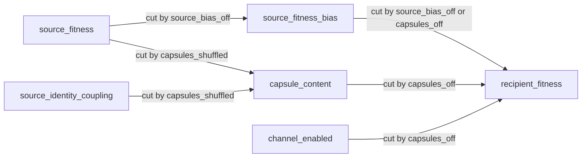

# Hard experiment 01 — capsule source-bias and next-generation fitness

One measurement question. Not a new Phase letter. Not intelligence.

**Question.** Does source-fitness-weighted capsule transfer change last-tick
(next-generation) mean fitness relative to (a) the same capsule channel with
source-fitness gating ablated, (b) capsules off, and (c) a digest-reproducible
shuffled-source negative control that preserves capsule traffic while destroying
source→recipient fitness coupling? Does the outcome change monotonically
across a `min_source_fitness` dose ladder?

Price-equation terms are a **statistical identity**, not automatic causation
(Okasha & Otsuka 2020; van Veelen 2020; Fronhofer et al. 2021; Glymour 2026
comments). Causal reading requires the DAG and `do()`-style arms below. Do
not treat a Price selection or transmission term as a mechanism proof.

**Claim ceiling:** `runtime_observation` until a dated, digest-backed campaign
artifact is archived. The design *may* later support `intervention_supported`
if and only if those archived numbers plus ClaimGate evidence flags warrant
it. This write-up is **pre-results**.

**Blocked:** `intelligence`, `collective_intelligence`, `agi`,
`tokyo_type1_passed`, `avida_replacement`, and related ClaimGate aliases.

## Design

| Item | Choice |
|---|---|
| Product | CodonTrace Genesis |
| Seeds | 12 paired (`11` … `22`) is the **smoke / exploratory** default (`StatisticalTestPolicy.tier_for_n(12) == exploratory_only`). Research-grade n is **30** (`tier_for_n(30) == research_grade_benchmark_candidate`). Claim language must match n. |
| Substrate | Phase A `life_loop_world` overlay (does **not** change A–E pins) |
| Ticks / N | 6 ticks, population 4 |
| Treatment | `source_bias_on`: capsules on, `min_source_fitness=2.0`, `FITNESS_WEIGHTED`, shuffle off |
| Ablation | `source_bias_off`: capsules on, `min_source_fitness=0.0`, `THRESHOLD` |
| Channel off | `capsules_off`: transfer disabled |
| Negative control | `capsules_shuffled`: same knobs as treatment, `CapsuleShuffleMode.SOURCE` permutes source identities / weights |
| Dose-response | `min_source_fitness` ∈ `{0.0, 1.0, 2.0}` on the FITNESS_WEIGHTED channel (shuffle off). Report monotone / null honestly. |
| Outcome | last-tick `selection_mean_fitness` (terminal / next-generation population state) |
| Effect size | `estimate_effect_size_lite` plus paired `d_z`, BCa CI, sign-flip *p*, Holm across the three planned contrasts |
| Replay | independent re-run of first and last seeds × every arm; spec + result digests must match |
| Library | `codontrace.genesis.hard_experiment_01` |
| Example | `examples/genesis_hard_experiment_01.py` |

`CapsuleAblationPolicy.enable_source_fitness_weighting` is a digest-backed
policy object and is **not** the runtime gate. This experiment uses the
wired `CapsuleTransferConfig` knobs (`min_source_fitness`, adoption policy,
`shuffle_mode`).

Goldsby et al. 2012 isolation / knockout is the **ablation pattern**
(channel off / shuffled), not a second product story and not a PNAS
replication. `is_goldsby_2012_pnas_experiment` stays false.

## Causal DAG

Nodes: source fitness, source-identity coupling, capsule content, source-fitness
bias, channel on/off, recipient fitness. Edges are justified in
`hard_experiment_01_dag()`. Each arm is one `do()` intervention that cuts a
named edge. Price terms are not nodes.



| Node | Role |
|---|---|
| `source_fitness` | Exposure: emitting organism's measured fitness |
| `source_identity_coupling` | Binding of payload / weights to that emitter |
| `capsule_content` | Mediator: pattern, prediction, graph digest |
| `source_fitness_bias` | Mechanism: FITNESS_WEIGHTED + `min_source_fitness` |
| `channel_enabled` | Gate: `CapsuleTransferConfig.enabled` |
| `recipient_fitness` | Outcome: last-tick mean fitness |

| Edge | Justification | Cut by |
|---|---|---|
| source_fitness → source_fitness_bias | Fitness is the numeric input to weighting / gating | `source_bias_off` |
| source_identity_coupling → capsule_content | Payload stays tied to the emitter unless SOURCE shuffle permutes it | `capsules_shuffled` |
| source_fitness → capsule_content | Fitter sources *may* emit different content (observational until identity is cut) | `capsules_shuffled` |
| source_fitness_bias → recipient_fitness | Weighting changes which capsules are adopted | `source_bias_off`, `capsules_off` |
| capsule_content → recipient_fitness | Adopted payload can change recipient fitness if the channel is on | `capsules_off` |
| channel_enabled → recipient_fitness | Channel-off severs every capsule-mediated path | `capsules_off` |

`source_bias_on` cuts **no** edge: it is the treatment (`do(channel=on,
source_fitness_bias=on, source_identity_coupling=intact)`).

## Interventions

Each arm is one explicit intervention. A null or small effect is valid.

| Arm | Role | Knob | Applied value | `do()` | Cuts |
|---|---|---|---|---|---|
| `source_bias_on` | treatment | `min_source_fitness` + `adoption_policy` | `2.0` / `FITNESS_WEIGHTED` / shuffle off | channel on, bias on, identity intact | none |
| `source_bias_off` | mechanism ablation | same knobs | `0.0` / `THRESHOLD` | `do(source_fitness_bias=off)` | source_fitness → bias |
| `capsules_off` | channel off | `CapsuleTransferConfig.enabled` | `False` | `do(channel_enabled=off)` | channel → recipient |
| `capsules_shuffled` | negative / specificity control | `shuffle_mode` | `SOURCE` (identities / weights permuted; traffic preserved) | `do(source_identity_coupling=permuted)` | identity → content |

`capsules_shuffled` is digest-reproducible. It keeps capsule traffic and
FITNESS_WEIGHTED adoption structure and destroys the source→recipient
fitness coupling. That is the specificity control: if the treatment effect
survives shuffle, it is not specifically source-fitness-tied content.

See `hard_experiment_01_interventions()` and
`hard_experiment_01_shuffled_control_properties()`.

## Dose-response

Knob: `CapsuleTransferConfig.min_source_fitness` on the treatment channel
(FITNESS_WEIGHTED, shuffle off). Default ladder: `0.0`, `1.0`, `2.0`.
This is **not** the Goldsby 2012 task-switching-cost dose; it is a
source-bias / channel knob. `0.0` with FITNESS_WEIGHTED is not the same
arm as `source_bias_off` (which also switches adoption to THRESHOLD).

`run_hard_experiment_01_dose_response()` records last-tick fitness per
level, drops missing outcomes instead of zero-filling, and reports
`monotone_report` as `increasing`, `decreasing`, `null`, or
`insufficient`. Flat and non-monotone curves are honest nulls.

## How to run

```python
from codontrace.genesis.hard_experiment_01 import (
    evaluate_hard_experiment_01_claim,
    hard_experiment_01_dag,
    run_hard_experiment_01,
    run_hard_experiment_01_dose_response,
)

campaign = run_hard_experiment_01()  # 12 seeds: exploratory / smoke
# research-grade language requires seed_count=30
print(campaign.statistical_tier)
print(campaign.mean_delta_vs_source_bias_off)
print(campaign.mean_delta_vs_capsules_shuffled)
print(campaign.effect_vs_capsules_off.interpretation)
print(evaluate_hard_experiment_01_claim(campaign).final_claim)
print(hard_experiment_01_dag().digest)

dose = run_hard_experiment_01_dose_response(seed_count=12)
print(dose.monotone_report)
```

```bash
python examples/genesis_hard_experiment_01.py
# research-grade path (slow): python examples/genesis_hard_experiment_01.py --research-grade
```

A null or small descriptive effect is a valid finding. The campaign object
refuses a claim ceiling other than `runtime_observation` and will not
construct if replay digests fail to match. `StatisticalTestPolicy.tier_for_n`
must match the seed count before any research-grade sentence is used.

## Results: not yet recorded

No campaign numbers are archived in this write-up.

- Mean deltas vs `source_bias_off` / `capsules_off` / `capsules_shuffled`: **not yet recorded**
- Paired `d_z`, BCa intervals, sign-flip *p*, Holm-adjusted *p*: **not yet recorded**
- Dose-ladder means and monotone/null report: **not yet recorded**
- Standardized effect sizes: **not yet recorded**
- Per-seed fitness vectors: **not yet recorded**
- Missing-outcome counts: **not yet recorded**
- Replay digest table (all arms × first and last seeds): **not yet recorded**

To generate a dated, digest-backed artifact later:

```python
campaign = run_hard_experiment_01(seed_count=30)
# persist campaign.to_dict() with date, git SHA, and campaign.digest
# do not paste informal terminal numbers into this section
```

A local `run_hard_experiment_01()` printout is a runtime observation, not
a publication-grade result. Do not copy informal numbers into this
section without that dated artifact. This section must not be filled with
intelligence, AGI, Tokyo Type 1, or Avida-replacement language.

Because results are not archived, ClaimGate stays at `runtime_observation`.
Do not raise the ceiling to `intervention_supported` from this document.

## What this does not say

- Capsule adoption is not knowledge transfer.
- Source-fitness gating is not communication intelligence.
- Last-tick fitness is not evolved instinct, OEE, or AGI.
- A shuffled control is not a Goldsby 2012 PNAS replication.
- A Price covariance is not a causal mechanism.
- This is not an Avida replacement study and not Phase L, M, or later.

Honesty pointer: [`WHY_NOT_INTELLIGENCE_YET.md`](WHY_NOT_INTELLIGENCE_YET.md).
Phase letter index: [`PHASE_INDEX.md`](PHASE_INDEX.md).
Replay pins: [`ENGINE_REPLAY_CONTRACT.md`](ENGINE_REPLAY_CONTRACT.md).
